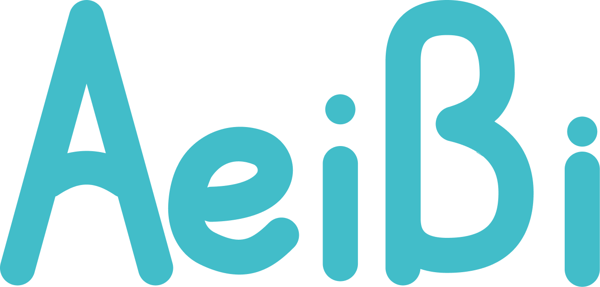

<div align="center">
  
  <p>
    A lightweight community platform focused on posting, discussion, relationships, and inbox notifications.
  </p>
</div>

<div align="center">

[](https://aeibi.com)
[](https://github.com/aeibi/aeibi-sns/graphs/contributors)
[](https://github.com/aeibi/aeibi-sns/network/members)
[](https://github.com/aeibi/aeibi-sns/stargazers)


</div>


> Live Demo: https://aeibi.com

## Project Status

The project is in an early stage. Core community flows are already in place, and features are being actively iterated.

## Features

- Account system: sign up, log in, token refresh, logout, profile updates, password change
- Content publishing: create posts (text, images, tags), edit/delete posts, public/private visibility
- Social interactions: likes, collections, comments, replies, comment likes
- Relationship graph: follow/unfollow, followers/following lists, relation search
- Inbox center: follow and comment notifications, unread counts, mark all as read, archive single messages
- Search & discovery: post search, tag search, user search, tag/user prefix suggestions
- Moderation: report posts, comments, and users
- File service: upload files, query metadata, retrieve file content (S3-compatible object storage)

## Quick Start (Docker Compose)

Use this mode when you want to run the full stack quickly with prebuilt images.

Start services:

```bash
docker compose -f docker/docker-compose.yaml up -d
```

Open: `http://localhost:38081`

> For production deployments, make sure to update credentials in `docker/docker-compose.yaml` and `docker/runtime/config.runtime.yaml` with strong, unique passwords/secrets before starting services.

## Local Development

Prerequisites:
- Go `1.25.4+`
- Docker Engine `28+`
- Docker Compose `v2+`
- Node.js `22.x` + pnpm `10+` (only required for Mode 1 frontend development or manual frontend rebuild)

### Startup Modes

Start required dependencies first (from repository root):

```bash
docker compose -f docker/docker-compose.dev.yaml up -d
```

Mode 1: Frontend dev server + backend-only API

Frontend:

```bash
cd web
pnpm install
pnpm run dev
```

Backend:

```bash
go run ./cmd backend --config ./config.example.yaml
```

Mode 2: Embedded frontend release + full backend

Start full service:

```bash
go run ./cmd --config ./config.example.yaml
```

Notes:

- In Mode 1, frontend is served by Vite dev server; backend serves API routes only (`/api/*` and `/file/*`).
- In Mode 2, backend serves embedded frontend assets from `web/dist`.
- `web/dist` is built by GitHub Actions (`.github/workflows/build-web-dist.yml`) whenever frontend source files change, so a fresh clone can run Mode 2 without local Node.js/pnpm.

## Star History

<a href="https://www.star-history.com/?repos=aeibi%2Faeibi-sns&type=date&legend=bottom-right">
 <picture>
   <source media="(prefers-color-scheme: dark)" srcset="https://api.star-history.com/chart?repos=aeibi/aeibi-sns&type=date&theme=dark&legend=top-left" />
   <source media="(prefers-color-scheme: light)" srcset="https://api.star-history.com/chart?repos=aeibi/aeibi-sns&type=date&legend=top-left" />
   
 </picture>
</a>

## License

MIT

## Contributing

Contributions of all kinds are welcome, such as bug fixes, new features, documentation improvements, etc.
