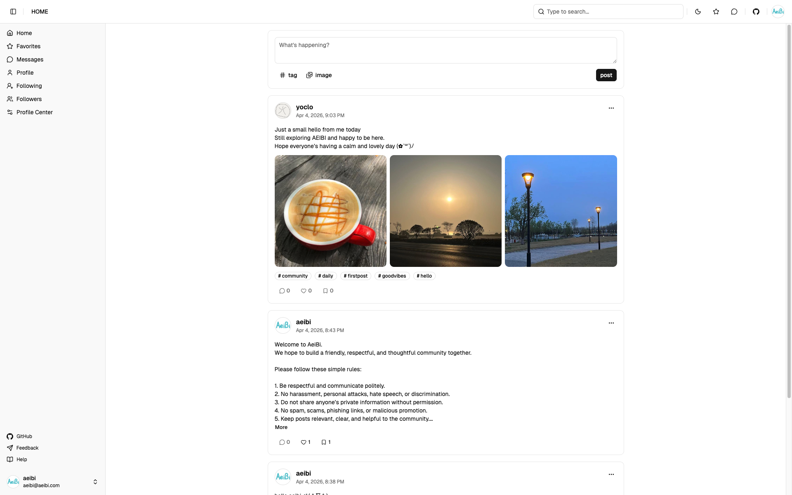

# AeiBi

An lightweight community platform. AeiBi focuses on core social flows like posting, discussion, relationships, and inbox notifications, with a clean and extensible architecture.

> Live Demo: https://aeibi.com

## Project Status

The project is in an early stage. Core community flows are already in place, and features are being actively iterated.

## Current Features

- Account system: sign up, log in, token refresh, logout, profile updates, password change
- Content publishing: create posts (text, images, tags), edit/delete posts, public/private visibility
- Social interactions: likes, collections, comments, replies, comment likes
- Relationship graph: follow/unfollow, followers/following lists, relation search
- Inbox center: follow and comment notifications, unread counts, mark all as read, archive single messages
- Search & discovery: post search, tag search, user search, tag/user prefix suggestions
- Moderation: report posts, comments, and users
- File service: upload files, query metadata, retrieve file content (S3-compatible object storage)

## Tech Stack

- Frontend: React 19, TypeScript, Vite, React Router, TanStack Query, Tailwind CSS v4, shadcn/ui
- Backend: Go, gRPC, gRPC-Gateway, PostgreSQL, sqlc, JWT auth
- Search: PGroonga (fuzzy search for posts/tags, prefix search for users/tags)
- Storage: S3-compatible object storage
- API pipeline: Protocol Buffers + Buf for gRPC/OpenAPI generation, Orval for type-safe frontend API clients

## Repository Layout

- Backend (main): repository root (`api/`, `cmd/`, `internal/`, `proto/`, etc.)
- Frontend: [`web/`](./web)
